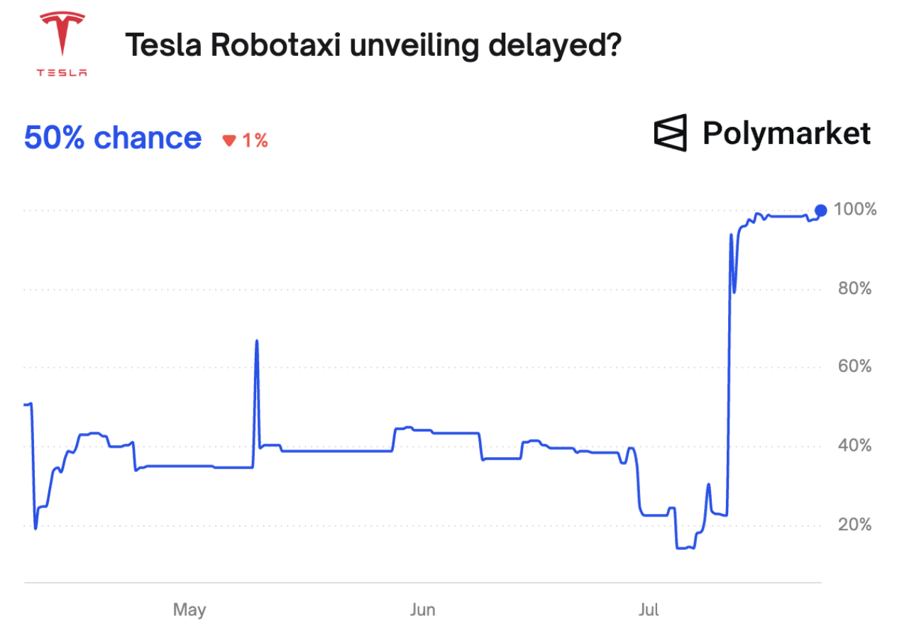

# AI-Enabled Semantic Matching for Cross-Platform Prediction Market Arbitrage

## Description

In a *prediction market*, traders buy and sell contingent contracts which correspond to the outcomes of real-world events. A "YES" contract pays $1 if a referenced event occurs and $0 otherwise, while the corresponding "NO" contract pays $1 if the event does not occur and $1 otherwise. Contracts for each market are commonly traded via a continuous double auction (CDA) on a central limit order book (CLOB); the balance of supply and demand leads to a market price which (in theory) may be interpreted as the probability of the underlying event.

The two most popular prediction markets at present are *Kalshi* and *Polymarket*. These platforms often list markets representing the same underlying event, such that there may be opportunities for cross-platform arbitrage. This project leverages Agentics to match markets across platforms based on their natural-language descriptions, which may subsequently be used to identify potential arbitrage trades.

To illustrate an example, the figures below show the markets "Tesla Robotaxi revealed on time?" (Kalshi) and "Tesla Robotaxi unveling delayed?" (Polymarket). An arbitrage exists if the sum of "YES" contract prices in both markets is less than $1 (net of fees), or if the sum of "NO" contract prices is greater than $1.




Generally, an arbitrage may be possible for two sets of markets which are *logically equivalent*, in that the outcomes for one set of markets imply the outcomes for the other set, and vice versa.


## Deployment Information

-   **Project Slug:** `cross-platform-pm-arbitrage`
-   **Deployment URL:** `https://[cloudfront-domain]/cross-platform-pm-arbitrage`
-   **Main File:** `app.py`

## Environment Variables Required

-   `GOOGLE_API_KEY`: Google Gemini API key
-   [List all other variables]

## Local Setup

```bash
# Install dependencies
pip install -r requirements.txt

# Run app
streamlit run app.py
```